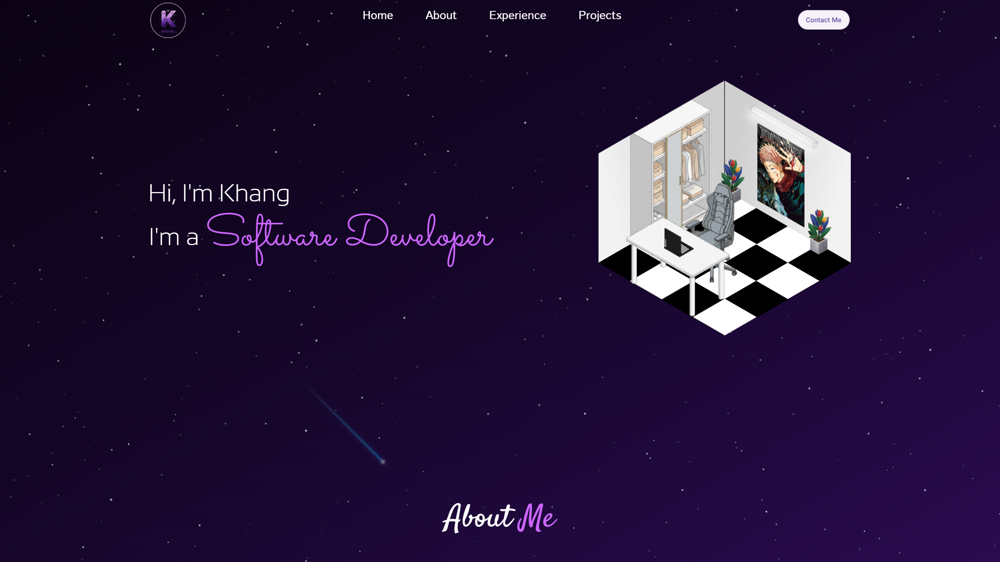

# Personal Portfolio Website 🚀

A modern, responsive, and high-performance portfolio website designed to showcase my professional journey, technical skills, and featured projects.

---

### 🌐 Live Preview

*Figure 1: High-level overview of the landing page and user interface.*

---

## 🛠️ Tech Stack

This project is built with the latest web technologies to ensure speed, SEO optimization, and a smooth user experience:

- **Framework:** [ReactJS](https://reactjs.org/)
- **Build Tool:** [Vite](https://vitejs.dev/) (for lightning-fast development and optimized production builds)
- **Styling:** [Tailwind CSS](https://tailwindcss.com/) (for utility-first, responsive design)
- **Routing:** [React Router](https://reactrouter.com/) (for seamless multi-page navigation)

## ✨ Key Features

- **Project Gallery:** A curated list of my best work, including descriptions, tech stacks, and links to repositories.
- **Experience Timeline:** A detailed breakdown of my professional and academic background.
- **Responsive Design:** Fully optimized for mobile, tablet, and desktop screens.
- **Modern UI/UX:** Clean aesthetics with smooth transitions and intuitive navigation.

## 📂 Project Structure

- `src/components`: Reusable UI components (Navbar, Footer, Project Cards).
- `src/pages`: Main view components (Home, About, Projects).
- `src/assets`: Images, icons, and global styles.

## 🚀 Getting Started

To get a local copy up and running, follow these simple steps:

### Prerequisites
- Node.js (v16.0 or higher)
- npm or yarn

### Installation
1. **Clone the repo:**
   ```bash
   git clone https://github.com/khangnguyen0810/portfolio-website.git
   ```
2. **Install dependencies:**
   ```bash
   npm install
   ```
3. **Run the development server:**
   ```bash
   npm run dev
   ```
4. **Build for production:**
   ```bash
   npm run build
   ```

## 📧 Contact
Feel free to reach out if you have any questions or want to collaborate!
- **GitHub:** [@khangnguyen0810](https://github.com/khangnguyen0810)
- **LinkedIn:** [@khangnguyen](https://www.linkedin.com/in/khang-nguyen-b52172229/)
